# Differentiators

There are several capabilities that were focused on as key differentiators for this accelerator. Their usage and business value is discussed here.

* [Autonomous Agent Capabilities](#autonomous)
* [Proactive Engagement and Response Routing](#proactive_engagement)
* [Integration to HR System (ServiceNow)](#hr_integration)
* [Approval Tracking](#approvals)
* [Document Manipulation](#document_manipulation)
* [Dynamically-Generated Adaptive Cards in Topics](#adaptive_cards)
* [Use of Custom Entities and Slot Filling](#slot_filling)

 
## Autonomous Agent Capabilities

Copilot Studio enables agents to not only respond to prompts and inputs from human users, but to also take action based on signals or events within an organization. This capability greatly expands the ability for agents to automate steps and processes, by acting **autonomously**. This accelerator makes use of both autonomous and interactive modes of operation. 

Autonomous capabilities are leveraged to take action as soon as the status of a relocation record in Dataverse gets updated to Relocated, by updating the employee's location in ServiceNow, and issuing a satisfaction survey proactively to the user.

Autonomous capabilities are enabled through the use of a Trigger, defined in the Copilot Studio agent Overview tab:

When creating a trigger in Copilot Studio, behind the scenes, a Power Automate flow is created, based on your selected configuration. The Power Automate flow is able to pass a payload of instructions and/or data when it invokes or triggers the agent.

In this accelerator, the triggering event is the update of the status of a relocation record to **Relocated**. The flow has access to all of the attributes of the updated record, and the node that is responsible for triggering the agent receives a payload of data with just the relevant information needed for the action it will take, as well as information about what the agent should do upon triggering. In this case, the agent is directed to execute a specific topic.

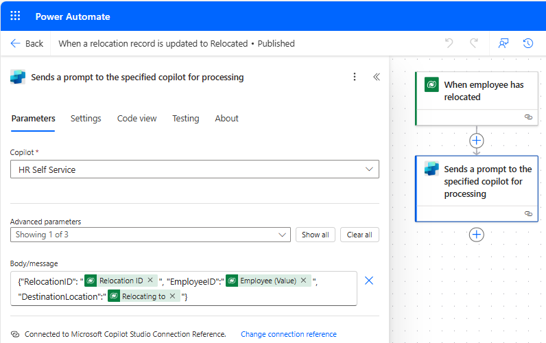

The agent will use the instructions and data provided to populate input variables for the topic that is being invoked:

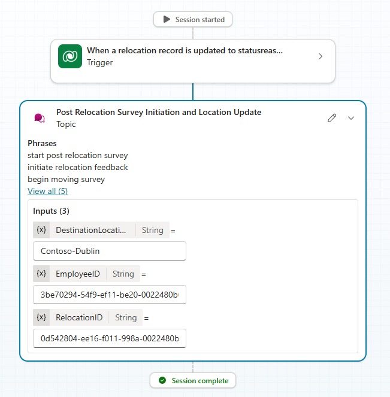

 
## Proactive Engagement and Response Routing

In this accelerator, there are several scenarios in which the agent is required to proactively reach out to the employee to progress the process of relocation.

To achieve this proactive engagement, and ensure that we are engaging with the employee in a contextually appropriate way, we use the Teams connector to send adaptive cards into the employee's chat with the agent, including information in the adaptive card to ensure the appropriate conversation will occur if the employee engages with the card.

We can see this through the example of our accelerator proactively presenting a relocation proposal to the employee, then responding appropriately when the employee takes action:

 * As discussed below, the Approval capabilities in Power Automate are leveraged to send an approval to an HR representative, and take action based on what action the HR representative takes
 * If the HR representative chooses to **Initiate Relocation**, Power Automate will use the Teams connector to send an adaptive card to the user:
    * 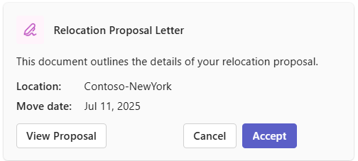
 * The card is posted as **Power Virtual Agents**, into the **Chat with bot**, specifying our agent as the value for **Bot**
    * 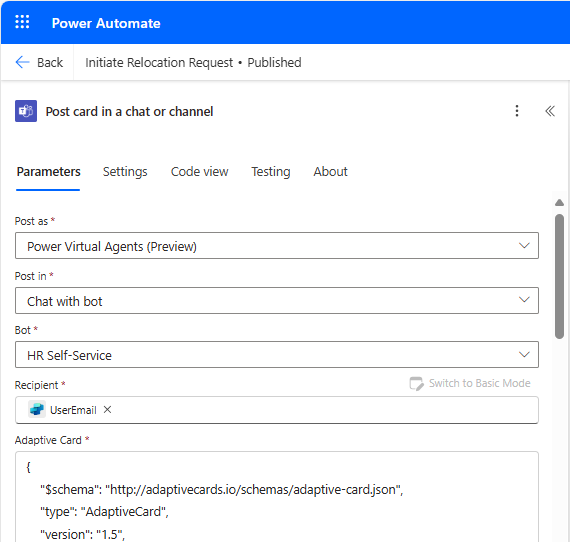
 * When generating and sending the adaptive card, specific data fields are included with each button on the card, with three parameters that will help the agent understand how to respond if the employee engages:
    * 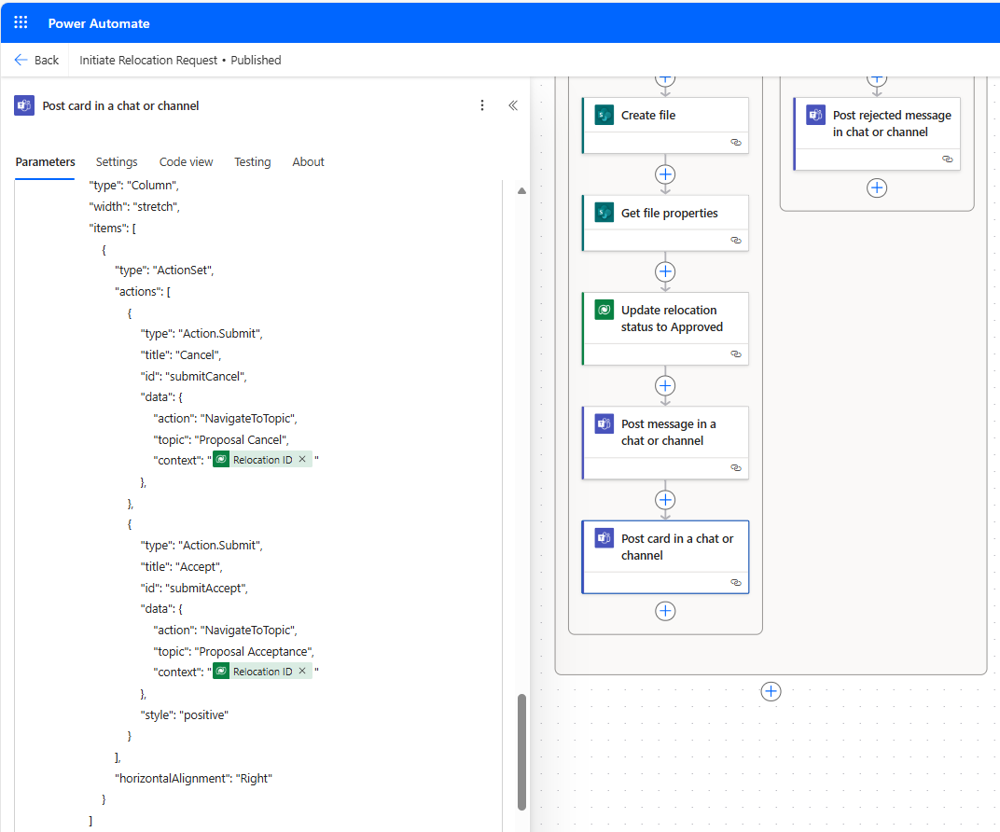
 * The three attributes included in the **data** node for each submit button (**action**, **topic**, and **context**) are passed through to the agent
 * A special **Message Distributor** topic is configured in the agent, and set to be triggered when any message is received, though with a filter such that **System.Activity.Value** is not blank. Thus, it will only run when data is present in the message posted. 
    * 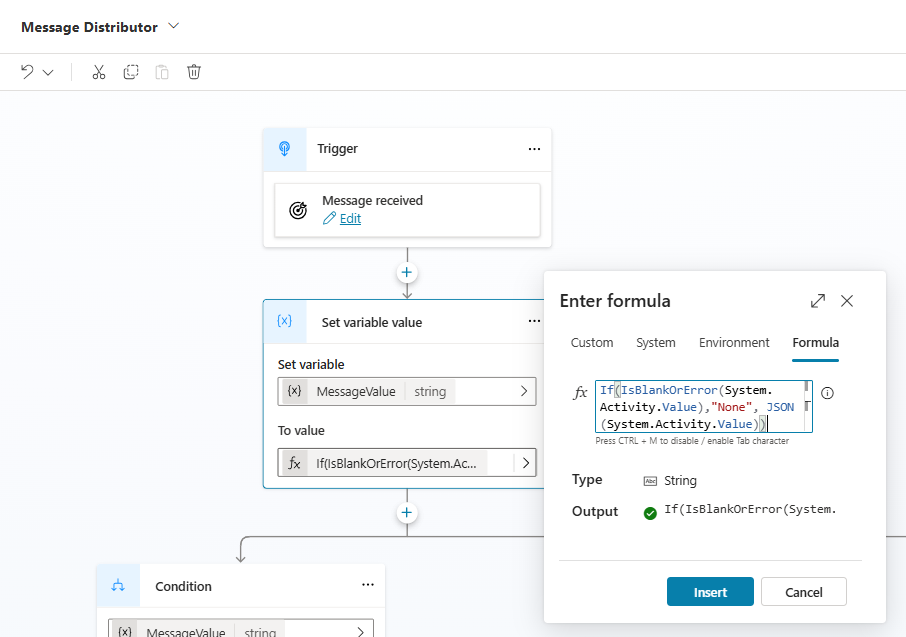
 * A Parse JSON node is used to get access to the three individual parameters, and based on their values, the appropriate topic is invoked. The context parameter provides the **relocation_id**, enabling the agent pass that as an input variable and to use that as context in the topic that is being called
    * 

 
## Integration to HR System (ServiceNow)

The business value provided by agents can be greatly enhanced when they are able to interact with data sources and systems of record. Copilot Studio agents are able to benefit from a large array of pre-built connectors, both Microsoft-based, and 3rd-party systems.

ServiceNow is a commonly-used platform for HR-related knowledge and data, and is used in this accelerator as a source of knowledge, as well as a source of employee data.

### User Data

As described in the installation instructions, this accelerator assumes that users will share a common email address across Entra ID, and their ServiceNow user. Thus, data relating to the user can be retrieved from ServiceNow via the **System.User.PrincipalName** of the user authenticated in Teams.

At key points in the agent flow, the topic Retrieve ServiceNow Details will be invoked to retrieve user information from ServiceNow (using the [ServiceNow Power Platform connector](https://learn.microsoft.com/en-us/connectors/service-now/)), to be referenced in subsequent processes:

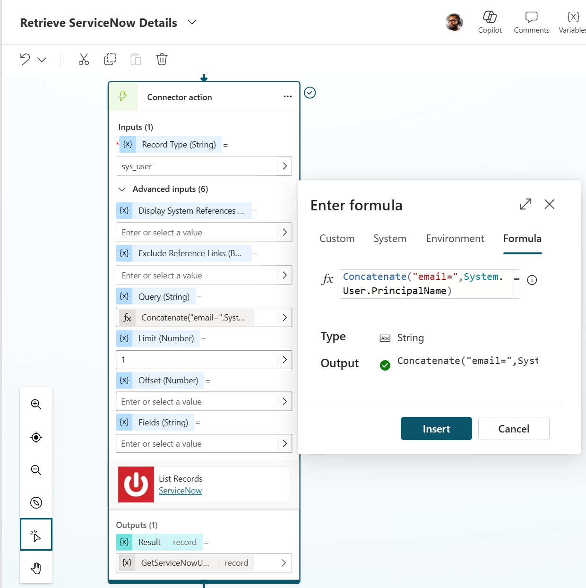

Similarly, the name of the user's location is also retrieved via the ServiceNow connector. And when the agent is autonomously invoked when the user status is set to **Relocated**, the connector is also used to update the location of the user in ServiceNow:

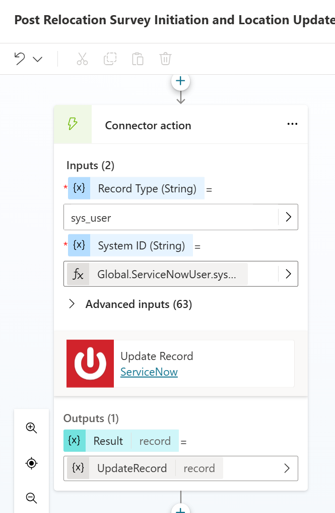

### Knowledge

This accelerator uses ServiceNow as the primary source of knowledge. It is used as both the repository of knowledge if no other intent is determined, as well as a source of content to summarize the benefits implications of moving from one location to another.

The consumption of ServiceNow knowledge is encapsulated in a separate topic, named **ServiceNow Knowledge Search**.

The topic receives three input variables:
 * **Query**: a string variable representing the query term to search for knowledge within
 * **RecordLimit** a number variable representing the maximum articles to return from ServiceNow
 * **KBtoSearch**: a string variable representing the sys_id of the knowledge base to restrict the search to. Note that by restricting searches to specific knowledge bases, we can ensure that the right knowledge is used at the right time

The Get Knowledge Articles connector action is invoked, to retrieve results, with **text** passed in as the **Fields** input, to ensure article contents are returned with the results.

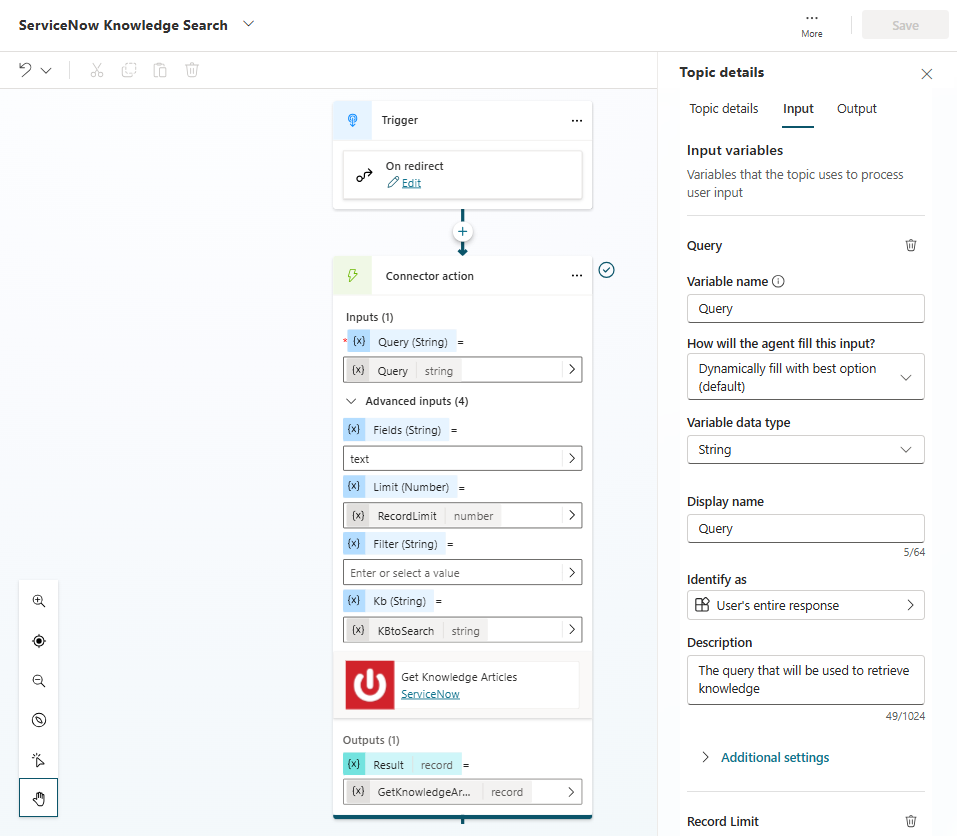

Some manipulation of the response data is needed to access the article contents, and prepare a table variable that can be used in a Generative Answers node.

The Generative Answers node is configured to use the custom table data, along with some additional instructions, to prepare a response to the query:

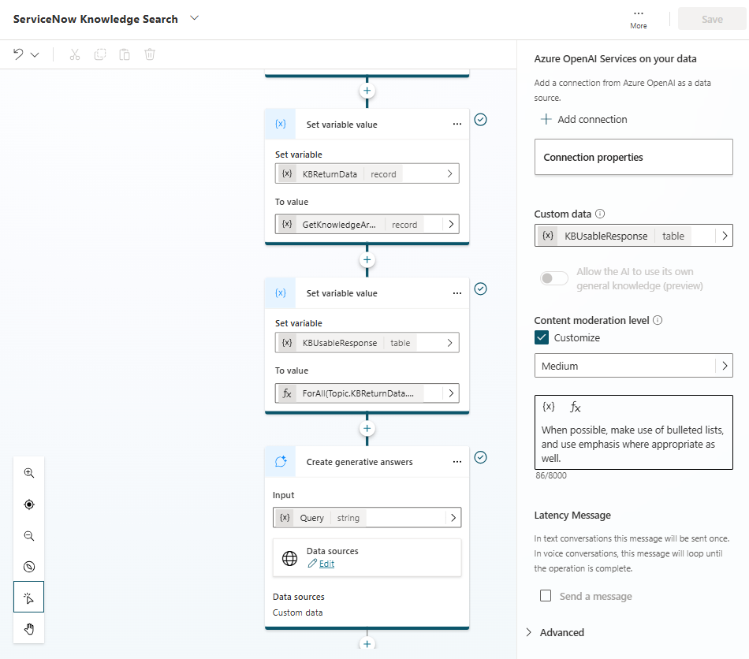

The **ServiceNow Knowledge Search** topic is redirected to from the **Conversational Boosting** topic, passing in the **sys_id** of the FAQ knowledgebase, which is retrieved from an Environment variable:

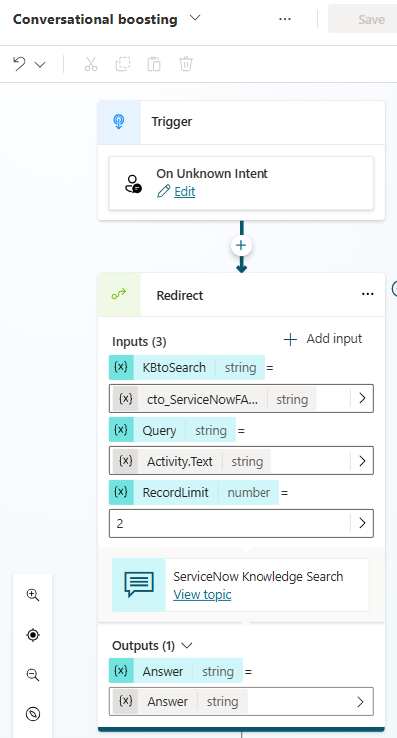

The topic is also redirected to from the **Relocation Impact Assessment** topic, in which the Benefits knowledge base is queried with a prepared query, to provide an overview of the potential differences in benefits between two office locations:

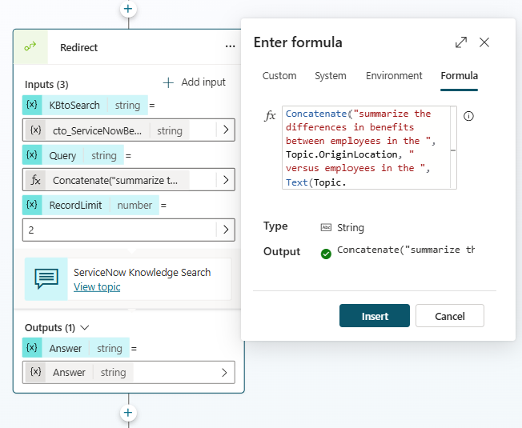

 
## Approval Tracking

When working with process-oriented scenarios such as an employee relocation, there will frequently be situations in which decisions or approvals will need to be made by other parties.

The [Approvals](https://learn.microsoft.com/en-us/power-automate/get-started-approvals) capabilities available through Power Automate and the [Teams Approvals app](https://learn.microsoft.com/en-us/microsoftteams/approval-admin) streamline these processes by infusing human approvals seamlessly into automation processes.

In this accelerator, employees are able to leverage the agent to submit requests to relocate. When these requests are submitted, the **Relocation Initiation** topic in the agent instantiates a Power Automate flow named **Initiate Relocation Request**.

This flow is responsible for:
 * Receiving the input parameters needed to progress the relocation request
 * Creating a record in the Relocations Dataverse table
 * Responding back to the Copilot Studio agent
 * Continuing in an asynchronous manner after responding to the agent
 * Using the Approval connector to send an approval request to a nominal HR representative
    * The approval request is able to be tailored with scenario-specific data, including Markdown-based formatted content. An Item Link and Item URL is also able to be specified, and in this accelerator, a link to the employee profile in ServiceNow is dynamically created and presented with the request
 * Waiting for the results of the approval, and then proceeding down an appropriate automation path, depending on the result
    * If the request is approved (via the **Initiate Relocation** option), the relocation record status is updated, a relocation proposal document is created, and the employee is proactively notified
    * If the request is rejected (via the **Reject Request** option)

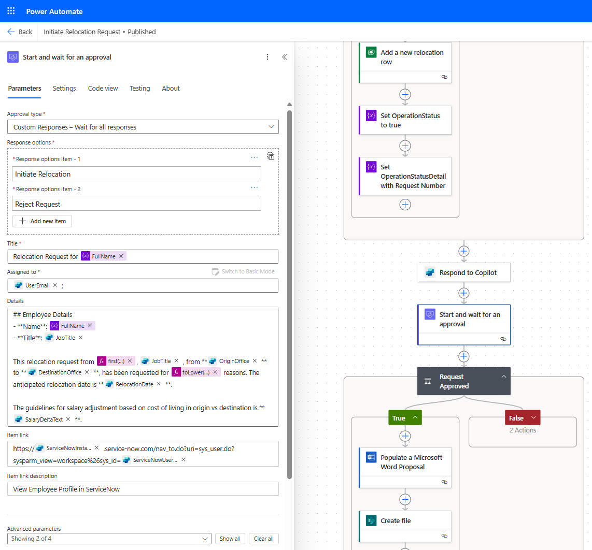

Note that the approval workflow continues after responding back to Copilot Studio. The methodology for re-engaging with the employee once the approval decision is made is described below.

 
## Document Manipulation

One of the key value propositions of this accelerator is the ability to auto-generate HR-related documents based process-related data, rather than requiring members of the HR team to manually draft them.

This is facilitated through the retrieval of the relevant content by gathering it through questions posed to the user, and connections to systems of record for employee data, then invoking a Power Automate flow to populate a Word template.

The document manipulation takes place in this accelerator after the initial relocation request is approved by the designated HR representative. At this point, the Power Automate flow continues, and:

* The [Word Online (Business) connector](https://learn.microsoft.com/en-us/connectors/wordonlinebusiness/) is used to populate placeholders within a Word template with dynamic values; See the connector documentation for how you can prepare your Word template with placeholders
* The [SharePoint connector](https://learn.microsoft.com/en-us/connectors/sharepointonline/) is used to create a file in SharePoint with the contents of the populated Word template
* The [Dataverse connector](https://learn.microsoft.com/en-us/connectors/commondataservice/) updates the appropriate relocation record in Dataverse with the document location and new status
* The [Teams connector](https://learn.microsoft.com/en-us/connectors/teams/?tabs=text1%2Cdotnet) is used to present an adaptive card to the user, with a button that will open the URL to the Word document in SharePoint

 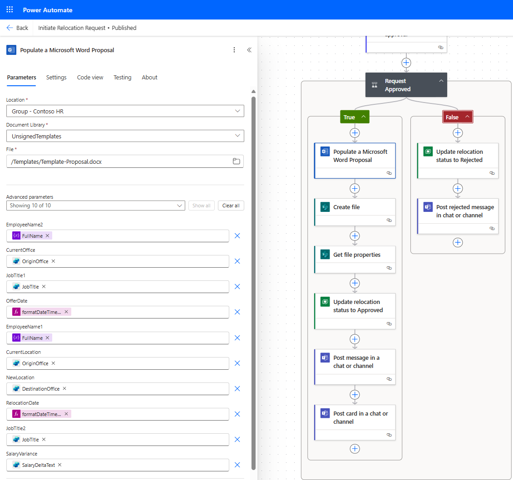

 
## Use of Custom Entities and Slot Filling

Agent conversations are enhanced through natural language processing and understanding, which allow the agent to understand the intent of the user, and take the appropriate action.

The experience for end users is enhanced when agents are able to not only understand intent, but also to identify specific entities within the conversation with the user. An entity can be thought of as a unit of information that represents a certain type of a real-world subject, like a phone number, city, or organization name. With the knowledge granted by entities, an agent can smartly recognize the relevant information from a user input and make use of it.

This accelerator offers two ways for users to engage with the agent:

* by clicking on one of the options in the adaptive card that greets them at the start of the conversation, or;
* by typing in an utterance such as **"I want to submit request to relocate to the New York office in three months time"**

When typing in **"I want to submit request to relocate to the New York office in three months time"**, the agent is able to intelligently identify that **"in three months time"** is indicative of the desired relocation date, and is thus able to skip over the step of asking the employee for their desired relocation timeframe.

This is facilitated by having a question node in which the response is identified as a **Date**, and specifying in the **Question behavior** that we **Allow question to be skipped**

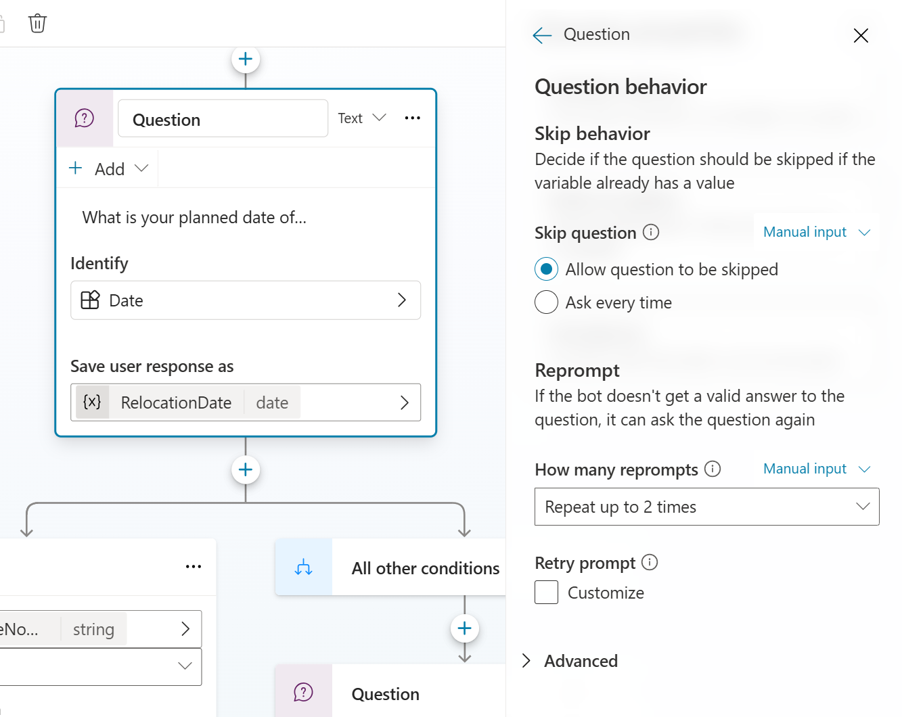

Similarly, we are able to identify the office that the employee wishes to relocate to, and can ensure that we are capturing a valid Contoso office location through the use of a **Closed-list custom entity**.

By defining a custom entity in which each of the five Contoso offices is included with synonyms, this allows us to more easily capture valid information, and provides a more streamlined and intuitive experience for the employees:

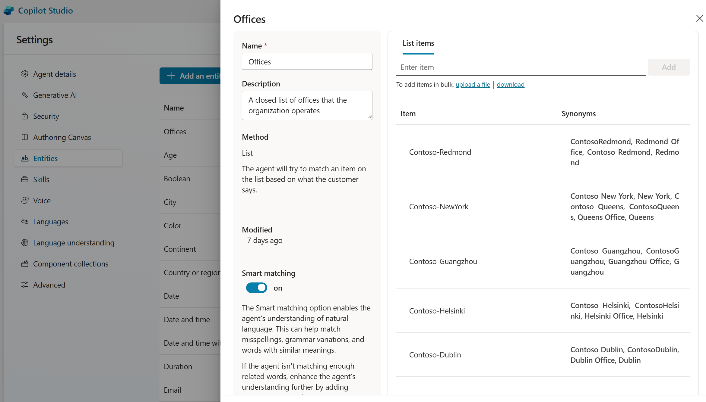

 
## Dynamically-Generated Adaptive Cards in Topics and Actions

When building agents in Copilot Studio, one of the tools available to create compelling experiences for end users is the ability to present Adaptive Cards.

Adaptive Cards are an open card exchange format enabling developers to exchange UI content in a common and consistent way.  Adaptive Cards are simple JSON objects that describe user interface cards that can include text, images, buttons, and more.

They can readily be created using a drag and drop interface in the [Adaptive Cards Designer](https://adaptivecards.io/designer/).

Once they have been created in the designer (or other tools), then can be presented to users in Topic Messages (by selecting **+Add > Adaptive card** in a Message node), used to gather information from the user (by adding an **Ask with an adaptive card** node to a topic), or displayed as an Action result (by selecting the **Send a message immediately after running this action**, and choosing **You create an adaptive card** option, on the **Outputs** tab of the Action).

The value of Adaptive Cards is enhanced when they are populated with dynamic data that is relevant to the end user or conversation. This is achieved by choosing the **Formula** option for defining the card, and authoring a formula that will return the desired JSON for your card, with variables populated.

This is an example of opting to enter a Power FX formula to define an Adaptive Card to be presented as a question node, with responses retrieved from button selections:

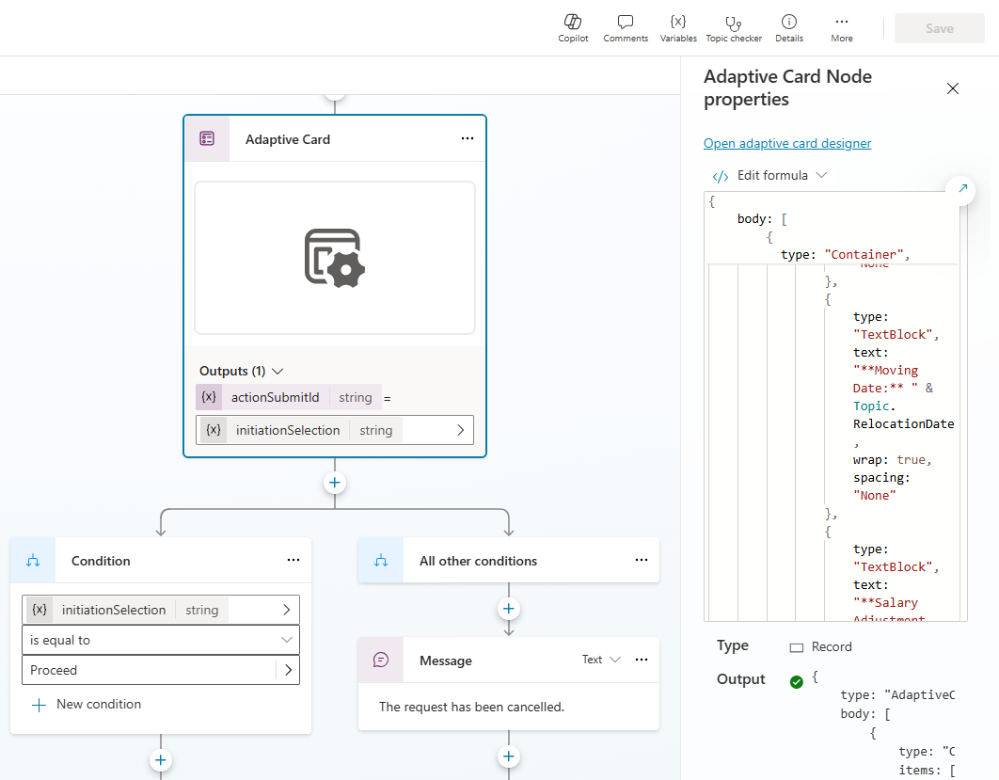

When creating your Power FX formula to produce your Adaptive Card content, you can include variable values that are available in your Action or Topic.

For example, one of the Adaptive Cards that is presented in the accelerator is this one, that displays a summary of a relocation request, with the option to submit it:

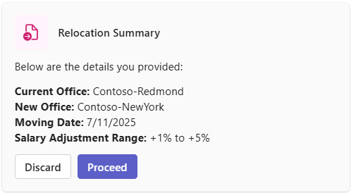

In this instance, a information about an employee's desired relocation is captured through dialogue, then populated within the card by referencing variable values, such as  
* **text: "**Moving Date:** " & Topic.RelocationDate**.

You can find the full Power FX formula for rendering this Adaptive Card [here](../AdaptiveCards_PowerFXFormulas/RelocationRequestSummary.txt), and you can find all other formulas used in this accelerator in the [AdaptiveCards_PowerFXFormulas](../AdaptiveCards_PowerFXFormulas/) folder.

